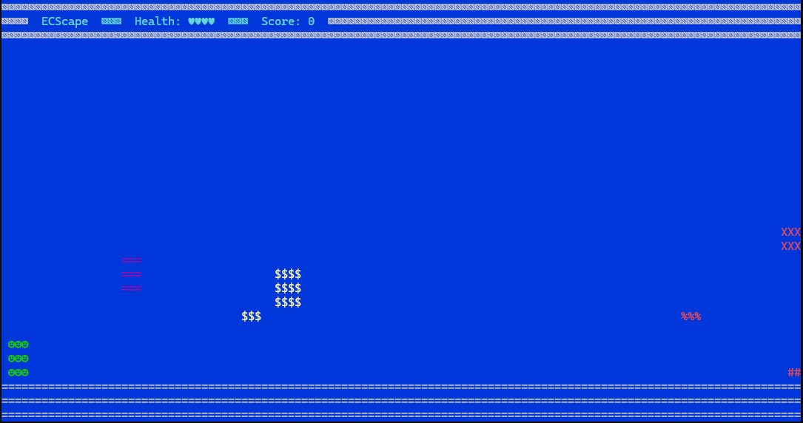

# 🚀 ECScape

**ECScape** is a simple experimental game built as a playground for testing the **Entity-Component-System (ECS)** architecture in .NET. It runs entirely in the **Console**, using ASCII graphics.

This project was created to:
- Explore the ECS architectural pattern in a hands-on way
- Experiment with real-time simulation in a .NET console

## 🛠️ Requirements

- [.NET 9](https://dotnet.microsoft.com/)  
- Windows terminal (uses `user32.dll` for async key input)

## Gameplay

🖼️ Evidently, stunning graphics isn't the primary goal of the project.

